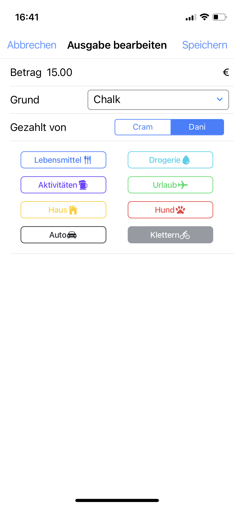
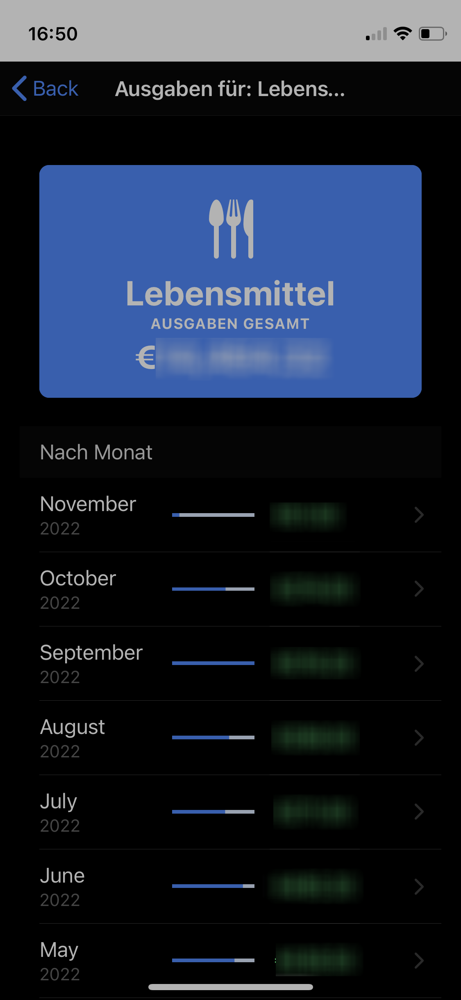

# Expenditure Tracker

A simple tool to keep track of all your expenditures.

## Features

- Multiple Users
- Multiple Tags per Expenditure
- Summaries by Tag / Date Range
- Automatic Dark Mode

## Development

To easily deploy the tool, create `.env` and run the deploy script. Example contents of `.env`:

```
DEPLOY_HOST="root@host.local"
DEPLOY_PATH="/mnt/SSD-Pool/iocage/jails/expenditures/root/usr/local/www/expenditures/"
```

## Screenshots







