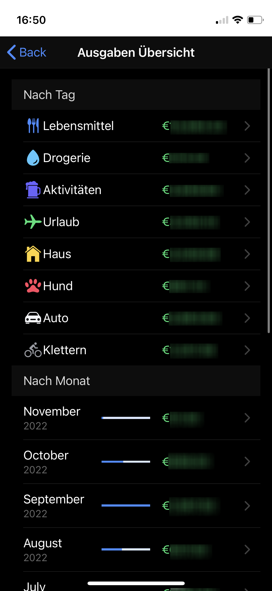

# Expenditure Tracker

A simple tool to keep track of all your expenditures.

## Features

- Multiple Users
- Multiple Tags per Expenditure
- Summaries by Tag / Date Range
- Automatic Dark Mode

## Setup

1. Create the database folder:
```bash
export DB_PATH=/var/expenditures
mkdir -p $DB_PATH
```

2. Run an interactive Python REPL inside the container
```bash
docker run -it --rm --name expenditures -v $DB_PATH:/var/expenditures/ -w /usr/local/expenditures/backend/expenditures dangrie158/expenditures poetry run python
# Python 3.10.13 (main, Oct 12 2023, 01:57:35) [GCC 12.2.0] on linux
# Type "help", "copyright", "credits" or "license" for more information.
# >>>
```

3. In this session initialize the db
```python
import app as app_module, models
app = app_module.get_app()
with app.app_context():
     app_module.db.create_all()
     models.Tag.insert_initial_values()
```

4. Next, create exactly 2 Users:
```python
with app.app_context():
    auth.Authenticator.add_user("User1", "password123")
    auth.Authenticator.add_user("User2", "hunter42")
```

Now you are ready for action. Press `Ctrl`+`D` to exit the REPL and run the container with port 5100 exposed:

```bash
docker run -it --rm --name expenditures -v $DB_PATH:/var/expenditures/ -p 5100:5100 expenditures dangrie158/expenditures
```
or use a docker compose file

## Screenshots



